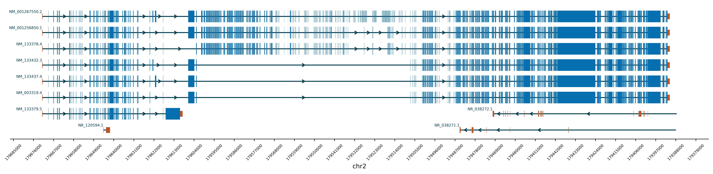

# AnnotateGene (Version 0.1)
## Introduction
Discovering a potential causal variant is exciting! We also want to now the exact location of the variant in the gene. To achieve this, we can go to NCBI gene or UCSC genome browser to check where is the variant. However, if we want to save those figures from NCBI or UCSC and use them in the publication or presentation, the only way is taking a screenshot. The bad thing is, we cannot control the colors, cannot add precise annotations (for example, add a copy number variant to show the exons affected), and cannot control the resolution of the figures.

Here, utilizing the gtf/gff files from NCBI RefSeq, I developed a tool that can plot the genes (transcripts), and annotate variants with precise location and customized color.

If you use this tool in your publication, please cite this repository. Thanks!

---
## Resources used
gtf/gff files used from NCBI RefSeq: 

GRCh37 (Latest modified: 2022-03-12 12:43):
- https://ftp.ncbi.nlm.nih.gov/refseq/H_sapiens/annotation/GRCh37_latest/refseq_identifiers/GRCh37_latest_genomic.gtf.gz
- https://ftp.ncbi.nlm.nih.gov/refseq/H_sapiens/annotation/GRCh37_latest/refseq_identifiers/GRCh37_latest_genomic.gff.gz

GRCh38 (Latest modified: 2022-04-12 08:00):
- https://ftp.ncbi.nlm.nih.gov/refseq/H_sapiens/annotation/GRCh38_latest/refseq_identifiers/GRCh38_latest_genomic.gtf.gz
- https://ftp.ncbi.nlm.nih.gov/refseq/H_sapiens/annotation/GRCh38_latest/refseq_identifiers/GRCh38_latest_genomic.gff.gz

---
## Dependencies
Bash: tabix

Python package: Matplotlib

---
## Help page
<pre>
usage: AnnotateGene.py [-h] [-ga GRCh37,GRCh38] -gr chr:start-end [-c] [-fs width,height] [-dpi] [-o] [-m] [-mf]

optional arguments:
  -h, --help            show this help message and exit
  -ga, --GenomeAssembly GRCh37,GRCh38
                        The genome assembly version to be used, default is GRCh37.
  -gr, --GenomicRegion chr:start-end
                        The genomic region enquired. For example: chr2:179390716-179672150.
  -c, --Color           The color of intron, UTR, exon, and transcript name, respectively.
                        Default is "blue,green,blue,blue". Hexadecimal color codes are supported.
  -fs, --Figsize width,height
                        The size of figure use want to output. Default is "16,4".
  -dpi, --DotPerInch    The dpi of the figure. default is 100.
  -m, --Mutation        The mutation user want to annotate into the figure. 
                        Input is "mutation type,position,label,color".
                        Recommend use quotation mark in case of strange symbol(s) in the label.
                        (1) SNV example:
                        "SNV,179623894,NP_001254479.2:p.(Lys3374*),Red"
                        (2) CNV example:
                        "CNV,179520894,179529894,1CNdeletion,Green"
  -mf, --MutationFile 
                        The file that contains mutations user want to annotate into the figure.
                        Each line one mutation. Same format with a single mutation.
  -ix , --InvertXaxis   Invert the x axis or not. Default is False.
  -o, --Output          The output image and it's file format default is "./AnnotateGene.png". If user want to output svg please use "-o ./AnnotateGene.svg".
</pre>

---
## Tutorial

### Example 1: Plot the gene.
There is only 1 compulsory parameter in AnnotateGene: **genome range**. If user want to plot the genes (transctips) only, just input the genomic range. 

For example:
```bash
python3 AnnotateGene.py -gr chr2:179390716-179672150
```


### Example 2: Add mutation annotation to it.
If user want to add mutation annotation to the figure, just add the parameter **-m** or **-mf**.

For example:
```bash
python3 AnnotateGene.py -gr chr2:179390716-179672150 -mf ./Example/Example2_Mutation.txt
```


### Example 3: Invert the x axis.
If user want to invert the x axis, just add the parameter **-ix True**.

For example:
```bash
python3 AnnotateGene.py -gr chr2:179390716-179672150 -ix True
```


---

## Author
Yao LEI (Leo), M.Sc. <br>
PhD student, Department of Paediatrics and Adolescent Medicine, The University of Hong Kong.
